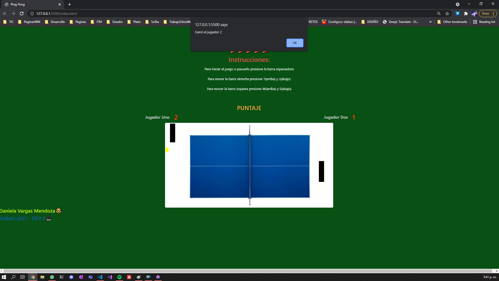

# ping-pong
## Practica MVC | Javascript | SofkaU
 

# URL : https://danvar03.github.io/PracticaMVC/
### Funcionamiento
Este es un juego de ping pong donde se utilizan los siguientes modelos,metodos y librerias
##### Version 1.0.00
- Modelo MVC
- Canvas
- Javascript con modelo en prototipos codigo Base del tutorial
- Programacion orientada a objetos.

#### Uso de la aplicacion
- enter : Para Inicializar el Juego y Continuar despues del Game Over
- espacio  : Pausa el juego o lo inicializa.
- ↑↓ : Mueve la barra izquierda.
- S W : Mueve la barra derecha

